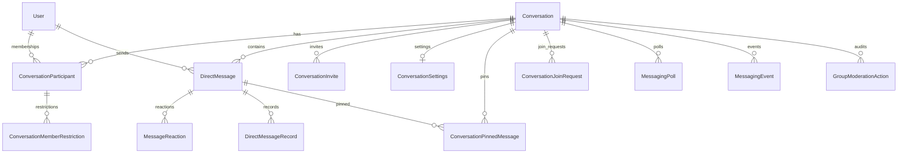

# Phase 29.0 — Enterprise Messaging Groups  
## Architecture & Technical Design

| Field | Value |
|-------|--------|
| **Feature name** | Enterprise Messaging Groups |
| **Phase** | 29.0 (Architecture & Technical Design) |
| **Status** | **PASS** — design complete; implementation must not start until this gate is accepted |
| **Date** | 2026-07-21 |
| **Deployment** | **Do not deploy** in this phase |
| **Predecessor** | Phase 22.1 core, **22.2 group messaging**, 22.3 presence/receipts/privacy |

---

## 1. Executive definition

**Enterprise Messaging Groups** are first-class multi-party **messaging rooms** inside Scrolith Messaging.

They are **not**:

| Product | System | Tables / surface |
|---------|--------|------------------|
| Community Groups / Clubs | Social community | `CommunityClub`, `ClubMembership` |
| Community Channels / Forums | Community chat | `CommunityChannel`, `CommunityMessage` |
| Business Pages | Org presence | Business page models |
| Social “groups” as feeds | Posts / Scroll | Feed graph |

They **are**:

- Multi-member rooms of type `Conversation.type = GROUP`
- Same message transport as Direct Messages: **`DirectMessage`**
- Same realtime namespace, notifications, attachments, reactions, voice notes, privacy controls
- Extended with enterprise **identity, permissions, join lifecycle, moderation, discovery policy, and admin ops**

**Comparable product bar:** WhatsApp / Telegram / Slack / Teams–class group chat, fully integrated with Scrolith Messaging.

---

## 2. Non-negotiable invariants

### 2.1 Do not break

All existing capabilities continue on the **same code paths** (conversationId-scoped). Regression suite must cover:

Direct Messages · Message Requests (prefs) · Read/Delivery Receipts · Presence · Typing · Recording · Attachments · Voice Notes · Reactions · Replies · Forward (where implemented) · Pins/stars · Search · Mentions · Notifications · Archive · Mute · Labels · Delete · Report · Block · Privacy · Media uploads · Wallet / Marketplace / Job notification channels (orthogonal; no regression)

### 2.2 Architecture rules

1. **One message table:** `DirectMessage` only — no parallel `GroupMessage`.
2. **One conversation graph:** `Conversation` + `ConversationParticipant`.
3. **Additive schema only** — no column removals, no destructive migrations, no rewrites of history.
4. **No microservices split** — extend Express + Prisma + existing Socket.IO `/community` namespace.
5. **No E2EE rewrite** in Phase 29 (encryption compatibility noted; honesty on transport TLS + existing security status API).
6. **Do not merge** Community Club/Channel pipelines into messenger.
7. **Deploy only when ops requests** after Phase 29.7 certification.
8. **Do not start Phase 29.1** until Phase 29.0 is accepted (this document + completion gate).

---

## 3. Baseline already in production code (Phase 22.2)

Reuse; do not re-implement from zero.

| Capability | Location |
|------------|----------|
| `ConversationType`: DIRECT \| GROUP | Prisma |
| Group meta: title, description, avatarFileId, visibility PRIVATE/PUBLIC/UNLISTED | Conversation |
| Roles: OWNER, ADMIN, MODERATOR, MEMBER | ConversationParticipant.role |
| Per-member notify: ALL \| MENTIONS \| NONE | ConversationParticipant.notifications |
| Mute / archive / star / soft leave | ConversationParticipant |
| Invites + accept code | ConversationInvite |
| Mentions + mute bypass push | groupPolicy + messageNotifications |
| Group APIs | groupMessaging.controller + messages.routes |
| Create GROUP via POST /conversations | messages.controller |
| FE: create dialog, GroupManagePanel, Groups tab, join route | Messages.tsx, GroupManagePanel, App.tsx |
| Socket: messages:new/sent/updated/reaction/typing/recording/receipts | server.ts + MessageContext |
| Small-group receipt cap | receiptPolicy |

**Honest gap:** Phase 22.2 is a **foundation**, not the full enterprise product (wizard, SECRET mode, granular permission matrix, join policies, content policies, slow mode, polls/events, admin dashboard, analytics, threads, etc.).

---

## 4. Target product model

### 4.1 Group kinds (product)

| Product kind | Maps to schema | Discovery | Join |
|--------------|----------------|-----------|------|
| **Private Group** | `visibility=PRIVATE` + joinPolicy invite-only | Not searchable | Invite only |
| **Public Group** | `visibility=PUBLIC` + join open/request | Searchable / discovery | Open, request, or invite (config) |
| **Secret Group** | `visibility=UNLISTED` **or additive `SECRET`** + no preview | Not searchable; no previews | Invite only; highest privacy |

> **Decision (29.0):** Prefer additive enum value `ConversationVisibility.SECRET` in Phase 29.1 (non-destructive). Until migration ships, treat `UNLISTED` as “secret-like” interim with policy flags in JSON.

### 4.2 Roles (product → schema)

| Product role | Schema | Notes |
|--------------|--------|-------|
| Owner | OWNER | Exactly one primary owner; transfer supported in 29.4 |
| Co-Owner | ADMIN + permission profile flag `isCoOwner` **or** additive CO_OWNER | Prefer **permission profile** first to avoid enum churn |
| Administrator | ADMIN | |
| Moderator | MODERATOR | |
| Member | MEMBER | |
| Guest | MEMBER + permission profile `guest` | Restricted matrix |
| Read Only | MEMBER + profile `readOnly` | |
| Bot | MEMBER + `isBot` on participant meta | System senders via isSystem messages |
| Verified Organization | Conversation-level `orgVerified` + owner linkage | Not a member role |

**Decision:** Keep core enum ranks (OWNER > ADMIN > MODERATOR > MEMBER). Enterprise granularity lives in **`MessagingGroupPermissionProfile`** (JSON templates + optional overrides), not dozens of enum values.

### 4.3 Messaging content

All group messages remain `DirectMessage` rows.

| Content | Implementation strategy |
|---------|-------------------------|
| Text, files, voice notes, system | Existing `DirectMessageType` + attachments File IDs |
| Images/video/docs | attachments + File MIME; content policy gates upload |
| Polls | New `MessagingPoll` (+ options/votes) linked by `conversationId` + system or metadata message pointer — **not** CommunityPoll |
| Events | New `MessagingEvent` linked same way |
| Location / contact / GIF / sticker | `messageType` extensions **or** `metadata.kind` with TEXT/FILE — prefer **metadata.kind** in 29.2 to avoid enum explosion; add enum values only when needed for indexing |
| Threads | Optional `threadRootMessageId` additive column on DirectMessage (29.2) |
| Pins | New `ConversationPinnedMessage` table (29.1) — not participant isStarred |
| Quotes | Existing replyToMessageId + snapshot |

---

## 5. Logical architecture

```
┌─────────────────────────────────────────────────────────────────┐
│ Clients: Web Messages · Desktop Dock · Android WebView · Deep links │
└────────────────────────────┬────────────────────────────────────┘
                             │ HTTPS + Socket.IO /community
┌────────────────────────────▼────────────────────────────────────┐
│ Express /api/messages/*  (+ future /api/admin/messaging-groups)   │
│ Controllers: messages · groupMessaging · groupEnterprise (new)    │
│ Policies: groupPolicy · permissionEngine (new) · notificationPolicy│
│ Services: messageNotifications · presence · receipts · emailPolicy │
└────────────────────────────┬────────────────────────────────────┘
                             │
┌────────────────────────────▼────────────────────────────────────┐
│ PostgreSQL (Prisma)                                               │
│ Conversation (GROUP) ──┬── ConversationParticipant               │
│                        ├── ConversationInvite (+ policy fields)  │
│                        ├── DirectMessage (+ optional thread root)│
│                        ├── MessageReaction · DirectMessageRecord │
│                        ├── ConversationSettings (new, 1:1)       │
│                        ├── ConversationPinnedMessage (new)       │
│                        ├── MessagingPoll / MessagingEvent (new)  │
│                        └── GroupModerationAction (new audit)     │
│ File / FileUsage / ClamAV path (existing)                         │
└─────────────────────────────────────────────────────────────────┘
```

### 5.1 Separation from Community

```
Messenger GROUP  ──source/sourceId optional──►  CommunityClub / Business / Org
        │                                              │
        └── DirectMessage only                         └── CommunityMessage (never mixed)
```

If a Community Club needs a messenger room, create `Conversation` with `source='community_club'`, `sourceId=<clubId>` — **do not** dual-write into CommunityMessage for enterprise groups.

---

## 6. Additive data model (Phase 29.1 target)

### 6.1 Conversation extensions (columns)

| Column | Type | Purpose |
|--------|------|---------|
| category | String? | Family, Work, Project, … |
| language | String? | BCP-47 |
| country | String? | ISO |
| region | String? | free text / admin taxonomy |
| timezone | String? | IANA |
| bannerFileId | String? | banner |
| emoji | String? | display emoji |
| accentColor | String? | hex |
| joinPolicy | Enum | OPEN \| REQUEST \| INVITE_ONLY |
| messagingMode | Enum | EVERYONE \| ADMINS_ONLY \| MODS_PLUS \| ANNOUNCEMENT \| READ_ONLY \| LOCKED |
| slowModeSeconds | Int @default(0) | cooldown between sends |
| maxMembers | Int? | cap |
| memberCount | Int @default(0) | denormalized |
| settingsVersion | Int @default(1) | optimistic concurrency |
| lockedAt / lockedReason | optional | emergency lockdown |
| archivedAt | DateTime? | admin archive |
| lastActivityAt | DateTime? | analytics |

### 6.2 ConversationSettings (1:1 JSON + typed flags)

Single row per group conversation for content toggles (images, videos, files, audio, voice, GIFs, stickers, polls, events, location, contacts, reactions, edit, delete, forward, copy) and restriction flags (external links, max mentions, message approval, media approval, keyword filters ref).

Prefer **typed booleans** for hot-path checks + `policyJson Json?` for advanced filters / AI hooks.

### 6.3 Permission profiles

```
MessagingRoleTemplate (system + custom)
  key, label, permissions Json  // full matrix defaults

ConversationRoleOverride
  conversationId, role | participantId, permissions Json  // sparse overrides
```

Runtime engine: `effectivePermissions(userId, conversationId) = template(role) ∪ participantOverrides ∪ conversation overrides`.

### 6.4 Invites lifecycle extensions

Extend `ConversationInvite` additively:

| Field | Purpose |
|-------|---------|
| maxUses | Int? |
| useCount | Int @default(0) |
| oneTime | Boolean |
| requireApproval | Boolean |
| previewDisabled | Boolean (secret) |
| qrTokenHash | String? |
| label | String? |

Statuses already: PENDING, ACCEPTED, REVOKED, EXPIRED. Add **REJECTED** only if needed for join requests.

### 6.5 Join requests

New table `ConversationJoinRequest`:

- conversationId, userId, message?, status PENDING/APPROVED/REJECTED, reviewedBy, timestamps  
- Unique active pending per (conversationId, userId)

### 6.6 Pins, moderation, mute variants

| Table | Purpose |
|-------|---------|
| ConversationPinnedMessage | messageId, pinnedBy, pinnedAt, rank |
| ConversationMemberRestriction | userId, kind MUTE\|SHADOW_MUTE\|BAN\|TEMP_BAN, until, reason, actorId |
| GroupModerationAction | audit append-only |

### 6.7 Explicit non-goals for 29.1 schema

- Do **not** create GroupMessage / GroupConversation duplicate tables  
- Do **not** drop or rename DirectMessage  
- Do **not** alter Community* models for this feature  

---

## 7. Permission engine

See **`PHASE29_0_PERMISSION_MATRIX.md`**.

Principles:

1. Default deny for elevated actions; default allow for MEMBER send in EVERYONE mode.
2. `messagingMode` can globally suppress send even if role has `canSend`.
3. Content settings can suppress media kinds even if `canUpload*`.
4. OWNER cannot be kicked; ownership transfer is explicit.
5. Platform SUPER_ADMIN / staff may break-glass via admin API + audit (29.4), not normal client.
6. Evaluation is pure function in `permissionEngine.ts` (unit-tested) called from controllers before mutations.

---

## 8. API design (backward compatible)

### 8.1 Preserve all existing routes

Existing `/api/messages/*` remain. Group create still works via:

`POST /api/messages/conversations` with `type: GROUP`.

### 8.2 Additive REST (Phase 29.1–29.5)

| Method | Path | Phase | Purpose |
|--------|------|-------|---------|
| POST | `/messages/groups` | 29.1 | Wizard create (full settings) — thin wrapper over conversation create |
| GET | `/messages/groups/discover` | 29.5 | Public group search |
| GET | `/messages/groups/:id` | 29.1 | Full group profile (settings, counts) |
| PATCH | `/messages/groups/:id` | 29.1 | Settings + meta |
| GET/PATCH | `/messages/groups/:id/permissions` | 29.1 | Effective + overrides |
| POST | `/messages/groups/:id/join` | 29.1 | Open join |
| POST | `/messages/groups/:id/join-requests` | 29.1 | Request join |
| POST | `/messages/groups/:id/join-requests/:id/decide` | 29.1 | Approve/reject |
| GET | `/messages/groups/:id/media` | 29.3 | Media browser filters |
| POST | `/messages/groups/:id/pins` | 29.2 | Pin message |
| POST | `/messages/groups/:id/polls` | 29.2 | Create poll |
| POST | `/messages/groups/:id/events` | 29.2 | Create event |
| GET | `/messages/groups/:id/analytics` | 29.5 | Member-visible analytics subset |
| * | existing members/invites/messages | — | Unchanged paths |

Admin (29.4):

| Method | Path |
|--------|------|
| GET/POST | `/api/admin/messaging-groups` |
| GET | `/api/admin/messaging-groups/:id` |
| POST | moderation actions, lock, archive, transfer ownership, export, retention |

**Rule:** Admin routes use existing admin auth + RBAC (`requirePermission`); never weaken.

### 8.3 Message send path (unchanged entry, extended gates)

```
POST /messages/conversations/:id/messages
  → auth
  → membership active
  → UserBlock check (hardening 29.1 — currently incomplete)
  → member restriction (ban/mute)
  → messagingMode + permissionEngine.canSend
  → content policy (media kinds, links, rate limit, slow mode)
  → existing postMessage body (clientMessageId, attachments, reply, mentions)
  → DirectMessage create
  → realtime fan-out
  → dispatchMessageReceiptNotifications (existing mute/level/mention)
```

DM path must short-circuit group-only gates so **DIRECT performance and behavior unchanged**.

---

## 9. Realtime / socket specification

**Namespace:** existing `/community` only.

### 9.1 Preserve existing events

`messages:new`, `messages:sent`, `messages:updated`, `messages:reaction`, `messages:typing`, `messages:recording`, `messages:read`, `messages:receipts`, `messages:conversation_updated`, `messages:conversation_deleted`, `presence:*`

### 9.2 Additive events (group lifecycle)

Emit to conversation members via `community:user:{userId}` (same pattern as today):

| Event | Payload (minimal) | Phase |
|-------|-------------------|-------|
| `messages:group_updated` | conversationId, patch, version | 29.1 |
| `messages:member_joined` | conversationId, member | 29.1 |
| `messages:member_left` | conversationId, userId | 29.1 |
| `messages:member_role` | conversationId, userId, role | 29.1 |
| `messages:permissions_updated` | conversationId, version | 29.1 |
| `messages:pin_updated` | conversationId, pins[] | 29.2 |
| `messages:poll_updated` | conversationId, pollId | 29.2 |
| `messages:event_updated` | conversationId, eventId | 29.2 |
| `messages:group_locked` | conversationId, locked | 29.4 |

**Naming rule:** Prefer `messages:*` prefix for FE MessageContext subscription consistency. Map executive names (`group.created`) to this family in docs only.

Typing for multi-member: FE upgrades display map `userId → state` (29.3); protocol already supports user attribution if payload includes senderId (verify/emit senderId in 29.2).

---

## 10. Frontend UX architecture

### 10.1 Surfaces

| Surface | Extension |
|---------|-----------|
| `/messages` workspace | Group Create Wizard; group chrome; pins; settings |
| Desktop dock | Group title/avatar; open manage; no DM merge for groups |
| `/messages/join/:code` | Invite + QR deep link |
| Admin dashboard | **Messaging Groups** under Messages |

### 10.2 Group Create Wizard (6 steps)

1. Identity — name, description, category, language, country/region, timezone, avatar, banner, emoji, accent  
2. Privacy — Public / Private / Secret  
3. Permissions — messaging mode + role template  
4. Joining — open / request / invite / link / QR / expiry / max uses  
5. Content — media and feature toggles  
6. Review — create  

Submit contract (backward compatible):

```ts
MessagingService.createGroup(wizardPayload)
// → POST /messages/groups  (preferred)
// fallback: POST /messages/conversations { type:'GROUP', ... }
```

### 10.3 Safe FE rules

1. Never route groups through `mergeDirectConversations`.  
2. Default create remains DM when type omitted.  
3. Reuse SmartComposer / MessageContext send path.  
4. Gate UI with `type === 'group'` + effective permissions from API.  
5. Extract `GroupCreateWizard.tsx`, `GroupSettingsPanel.tsx`, keep `GroupManagePanel` as members tab.

### 10.4 Mobile

- Capacitor deep links already support `/messages/:id` and join paths.  
- Push deep link uses conversationId (unchanged).  
- Offline: existing messagingEngine outbox — group messages use same queue; permission failures surface on retry.

---

## 11. Notifications

| Event | Push/In-app | Email |
|-------|-------------|-------|
| New group message | Existing path + mute/level/mention | **Offline + once/day** (messageEmailPolicy) |
| @mention | Mention bypass when muted | Same email policy |
| Invite / join request / promote | New templates (29.4) | Optional |
| Pins / events / polls | Prefer in-app; push if ALL | No spam email |

Do not re-enable per-message email spam.

---

## 12. Security & compliance

| Control | Approach |
|---------|----------|
| Auth | Existing JWT middleware |
| Authorization | permissionEngine + membership |
| Block | Enforce on send + add-member (29.1) |
| Invite abuse | maxUses, expiry, rate limit create invites |
| Attachments | Existing File pipeline + ClamAV |
| Audit | DirectMessageRecord + GroupModerationAction |
| Admin | RBAC permissions `messaging.groups.*` |
| Secret groups | No discovery; no link previews; invite previewDisabled |
| Rate limit | slowMode + per-user send rate + anti-spam hooks |
| Export | Admin-only + owner canExportChat permission |

---

## 13. Performance & scale

| Target | Strategy |
|--------|----------|
| 100k+ groups | Indexes on type, visibility, lastActivityAt; discovery cursor |
| Millions of messages | Existing conversationId + createdAt pagination; no full table scans |
| Large groups | Receipt watermark cap already; push fan-out batching; avoid N+1 member loads |
| Virtualization | Existing FE virtual lists |
| Cache | Optional Redis for presence (already dual-write ready); permission cache short TTL |
| CDN | File content URLs as today |

---

## 14. Phased delivery plan

| Phase | Name | Outcome | Deploy? |
|-------|------|---------|---------|
| **29.0** | Architecture & design | This package + PASS gate | No |
| **29.1** | DB & backend foundation | Migrations, settings, permissions, join, invites, block enforcement, APIs | No until requested |
| **29.2** | Realtime messaging engine | Gates on send, pins, polls/events, multi-typer, sockets | No |
| **29.3** | Frontend & UX | Wizard, group chrome, media viewer, dock polish | No |
| **29.4** | Admin & moderation | Admin dashboard, lock, ban, transfer ownership | No |
| **29.5** | Security, analytics, search | Discovery, analytics, advanced search filters | No |
| **29.6** | Testing & certification | Full regression + load + security suite | No |
| **29.7** | Deployment & production certification | Runbooks, rollout, smoke, PASS | **Only when requested** |

Each phase requires: architecture alignment · implementation · automated tests · regression · docs · completion gate · rollback plan · honest PASS/PARTIAL/FAIL.

**Gate rule:** Do not open Phase N+1 until Phase N completion gate is PASS (or explicit PARTIAL with scoped waiver).

---

## 15. Testing strategy (program-level)

| Layer | Focus |
|-------|-------|
| Unit | permissionEngine, joinPolicy, slowMode, invite lifecycle, groupPolicy compatibility |
| Integration | create group wizard API, DM regression, mute/mention push |
| Socket | member join fan-out, permissions_updated, no DM event pollution |
| E2E | create → invite → join → send → react → leave |
| Security | role escalation, secret discovery negative tests, block |
| Performance | large member list pagination, message cursor |
| Regression | Phase 22.1/22.2/22.3 suites must remain green |

---

## 16. Rollback philosophy

- Schema: additive columns/tables left unused if BE rolls back.  
- BE: previous Cloud Run revision.  
- FE: previous revision; wizard hidden behind flag if needed.  
- Feature flag (recommended): `MESSAGING_ENTERPRISE_GROUPS_V1=true` for create/discover advanced paths; core GROUP 22.2 remains available.

---

## 17. Documentation deliverables map

| Doc | Phase |
|-----|-------|
| This architecture | 29.0 |
| Permission matrix | 29.0 |
| Socket & API spec summary | 29.0 |
| ER diagram (mermaid) | 29.0 (below) |
| Migration notes | 29.1 |
| Admin guide | 29.4 |
| Developer guide | 29.1+ |
| QA certification | 29.6 |
| Deployment / runbook / rollback | 29.7 |

---

## 18. ER diagram (target)



---

## 19. Risks & mitigations

| Risk | Mitigation |
|------|------------|
| Scope explosion | Hard phase gates; MVP = 29.1–29.3 first vertical slice |
| DM regression | Group gates only when `type===GROUP`; regression suite |
| Confusion with Community Groups | Naming “Messaging Groups”; separate admin nav; no shared tables |
| Large group fan-out cost | Batch push; mention-only defaults for huge groups optional |
| Permission complexity bugs | Pure engine + exhaustive matrix unit tests |
| Migration load | Online additive migrations; no table rewrites |
| Numbering collision with Android Phase 29 push AAB | Document: **Messaging Groups = Phase 29 program**; Android store versions independent (1.1.x) |

---

## 20. Phase 29.0 completion criteria

- [x] Existing messaging architecture audited (BE + FE)  
- [x] Distinction from Community Groups documented  
- [x] Reuse of Conversation/DirectMessage mandated  
- [x] Additive schema plan defined  
- [x] Permission model defined  
- [x] API + socket extension plan defined  
- [x] Phased delivery + no auto-deploy rule  
- [x] Rollback philosophy  
- [x] Honest baseline vs target gap list  

**Implementation status:** Not started (by design).  
**Certification:** See `PHASE29_0_COMPLETION_GATE.json`.
