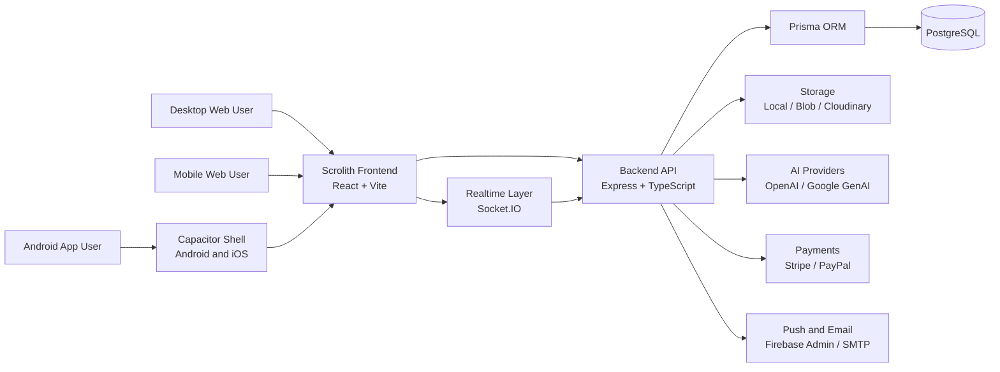
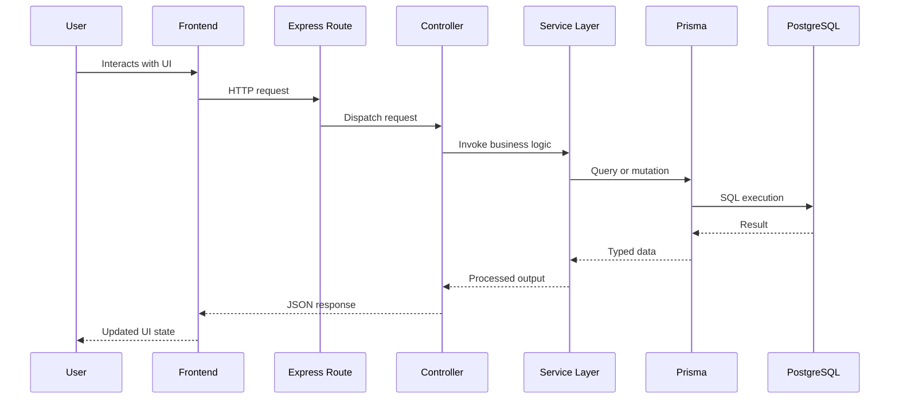
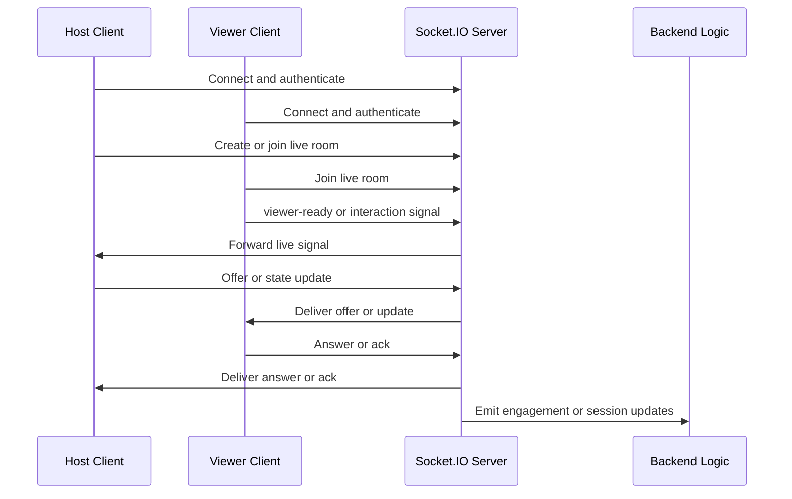
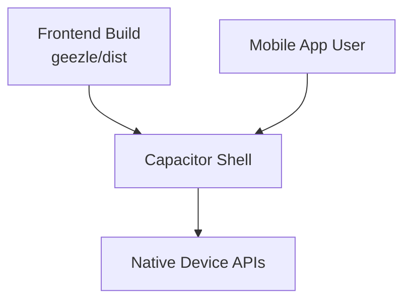
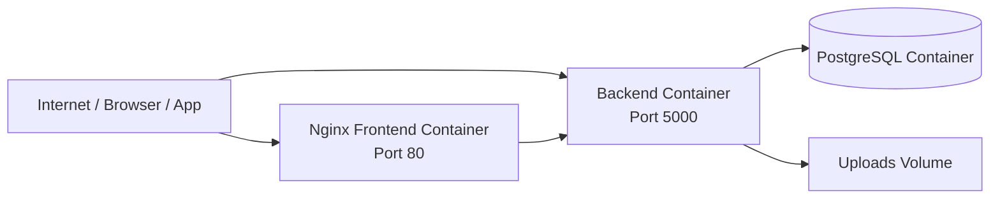

# Scrolith Technical Architecture Paper

## 1. Purpose

This document describes the technical architecture of Scrolith as it exists in the current repository. It focuses on:

- system composition
- runtime flow
- deployment topology
- data domains
- realtime behavior
- operational boundaries

It is implementation-grounded.

## 2. Platform Composition

Scrolith is composed of three major runtime layers:

- frontend application: `geezle/`
- backend API and realtime server: `geezle-backend/`
- Capacitor mobile shell: `mobile/`

Supporting assets include:

- Docker deployment files
- nginx frontend serving config
- production env templates
- cloud deployment documentation

## 3. Technology Stack

### 3.1 Frontend

- React 19
- React Router 7
- Vite 6
- TypeScript
- Tailwind CSS
- Axios
- Socket.IO client
- Recharts
- MapLibre GL

### 3.2 Backend

- Node.js
- Express
- TypeScript
- Prisma
- PostgreSQL
- Socket.IO
- Zod
- Helmet
- CORS
- rate limiting

### 3.3 Mobile

- Capacitor
- Capacitor Android and iOS
- Camera
- Filesystem
- Geolocation
- Preferences
- Push Notifications
- biometric-capable plugins

### 3.4 External integrations

- Stripe
- Firebase Admin
- Nodemailer
- Azure Blob Storage
- Cloudinary
- OpenAI
- Google Generative AI
- Redis

## 4. System Context Diagram

## 5. Repository Architecture

### 5.1 Frontend module structure

The frontend is organized by domain:

- `auth/`
- `community/`
- `components/`
- `context/`
- `dashboard/`
- `features/live/`
- `features/scroll/`
- `messages/`
- `mobile/`
- `pages/`
- `profile/`
- `services/`
- `utils/`

This indicates a feature-modular SPA architecture.

### 5.2 Backend module structure

The backend is organized into:

- `routes/`
- `controllers/`
- `services/`
- `middleware/`
- `modules/`
- `realtime/`
- `utils/`
- `prisma/`

This is a layered model where routes expose APIs, controllers orchestrate requests, services hold business logic, and Prisma manages persistence.

## 6. Request and Response Flow

### 6.1 Standard API flow

### 6.2 Frontend state model

The frontend uses provider-based shared state for platform concerns such as:

- user and session state
- notifications
- cart
- favorites
- content settings
- preloader behavior
- sockets
- i18n
- live feature flags

This reduces coupling between route modules and shared application logic.

## 7. Realtime Architecture

The backend boots a dedicated Socket.IO server in `server.ts`.

This enables:

- live streaming signaling
- messaging updates
- interactive engagement updates
- notification-related realtime behavior
- presence-style session awareness

### 7.1 Realtime flow diagram

## 8. Mobile Architecture

The mobile app uses Capacitor with:

- app id `com.scrolith.scrolith`
- app name `Scrolith`
- web output from `../geezle/dist`

That means:

- the mobile app consumes the same frontend build as web
- native capabilities are added through Capacitor plugins
- most feature delivery is shared across web and app

### 8.1 Mobile runtime diagram

## 9. Deployment Topology

### 9.1 Confirmed container deployment

`docker-compose.prod.yml` defines a production-style topology with:

- PostgreSQL database container
- backend container
- frontend container served through Nginx

### 9.2 Deployment diagram

### 9.3 Backend container lifecycle

The backend Dockerfile confirms this boot sequence:

1. install backend dependencies
2. copy source, Prisma, and scripts
3. run Prisma generate
4. expose port `5000`
5. apply Prisma migrations at startup
6. start the backend server

### 9.4 Frontend container lifecycle

The frontend Dockerfile confirms this sequence:

1. build the Vite app
2. inject public build env variables
3. copy build output into Nginx
4. serve static frontend assets

## 10. Environment Contract

The production env template establishes the runtime contract across:

- frontend public URLs
- backend URLs
- database URL
- JWT secret
- storage configuration
- email configuration
- payment configuration
- AI provider configuration

This cleanly separates:

- source code
- build-time configuration
- runtime infrastructure

## 11. Data Architecture

The Prisma schema confirms a relational model covering:

- identity and profile
- marketplace objects
- financial objects
- social objects
- moderation and trust objects
- insights and growth objects
- developer platform objects

### 11.1 Major data domains

Identity:

- `User`
- `Profile`
- settings and auth-related entities

Marketplace:

- gigs
- jobs
- proposals
- orders
- contracts

Social:

- community posts
- post comments
- reactions
- stories
- follows
- clubs, channels, and events

Finance:

- wallets
- transactions
- Gcoin wallets and Gcoin transactions
- withdrawals
- payout provider accounts

Trust and governance:

- KYC
- moderation cases
- violations
- staff profiles

Growth and intelligence:

- professional score
- achievements
- streaks
- opportunity matches
- topic follows
- skill gap reports

## 12. Security and Governance Controls

The repository confirms:

- JWT-based authentication
- role-based access behavior
- CORS allowlist handling
- Helmet security headers
- rate limiting
- maintenance middleware
- admin runtime control surfaces
- KYC and moderation-related schema

This means governance is treated as a platform concern.

## 13. Admin Control Plane

The admin dashboard includes modules for:

- overview
- market intelligence
- messages
- AI intelligence
- ATM tracker
- Scrolitha
- insights and growth
- gigs and jobs
- finance and payouts
- payment gateways
- CMS and homepage management
- blog
- Scroll
- live platform
- marketing
- users
- monetization
- files
- staff
- role management
- moderation
- KYC
- support
- system settings
- languages
- form builder
- apps
- developer platform
- system backup

This is one of the strongest signals that Scrolith is meant to operate as a managed platform business.

## 14. Architectural Strengths

The current architecture is strongest in:

- shared web/mobile delivery
- large integrated product surface
- modular domain separation
- strong admin plane
- broad relational schema
- realtime-capable infrastructure
- monetization and wallet readiness
- AI and insight extensibility

## 15. Architectural Risk Areas

This section is architecture-based, not incident proof.

Typical maturity areas for a platform with this shape include:

- live-stream signaling reliability
- realtime scale strategy across replicas
- observability and tracing depth
- background job isolation
- media storage and delivery consistency
- tighter config governance

These are normal hardening themes for a platform with this breadth.

## 16. Technical Conclusion

Scrolith already has the architecture of a real multi-domain platform:

- frontend application layer
- backend API and realtime layer
- relational data layer
- shared mobile delivery
- admin control plane
- monetization and AI extension points

The repository supports a credible technical conclusion: Scrolith is being built as a unified platform, not as a disconnected set of features.
